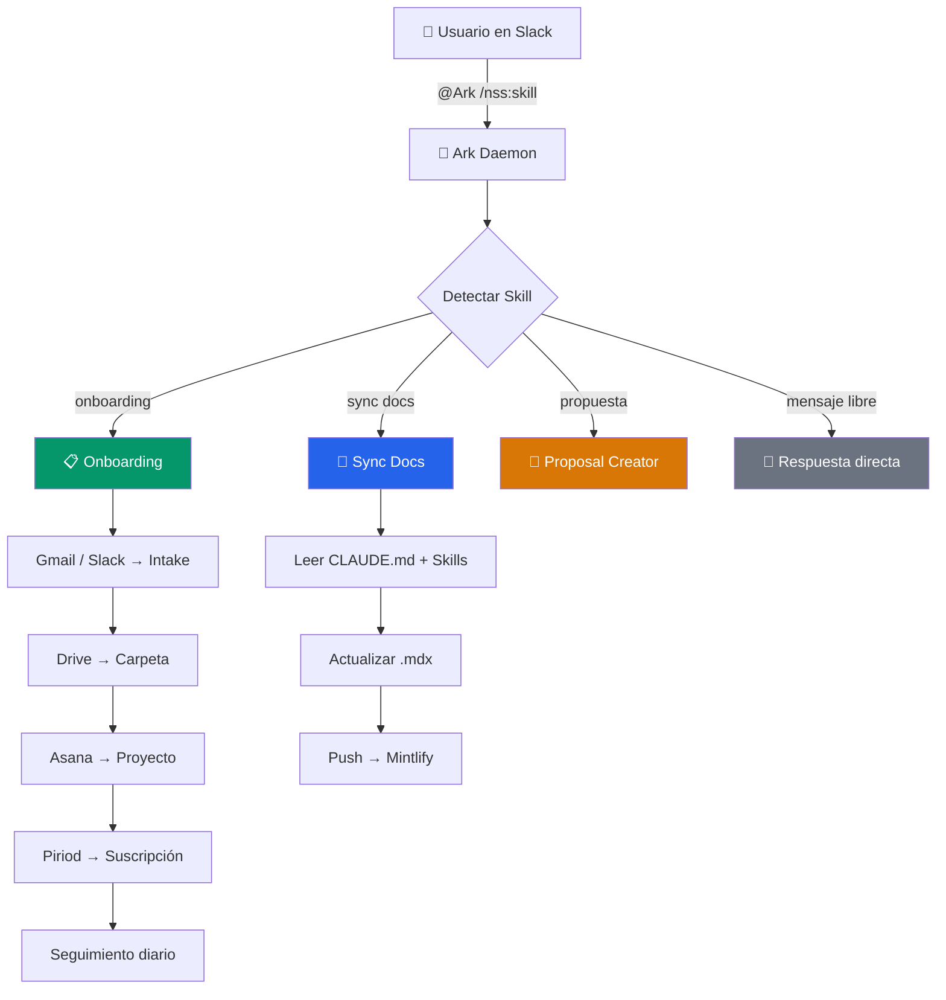
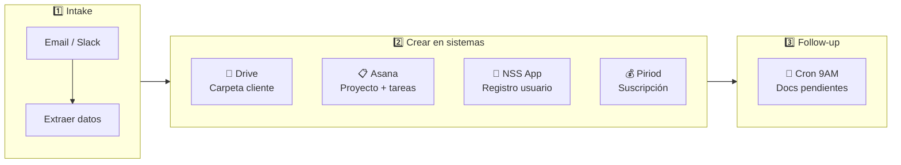
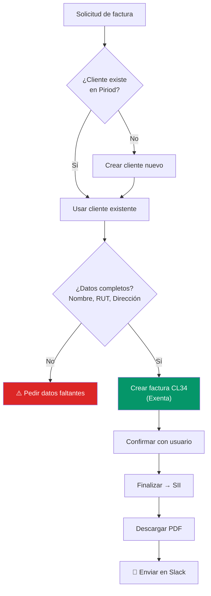
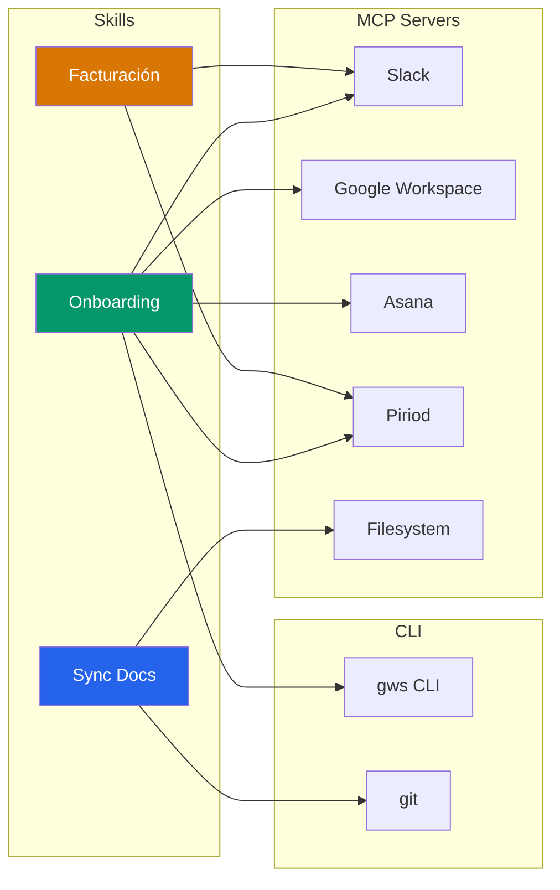

## Arquitectura de Skills

## Skills activos

<CardGroup cols={2}>
  <Card title="Onboarding" icon="user-plus" href="/skills/onboarding-skill" color="#059669">
    `/nss:onboarding` — Ingreso completo de nuevos clientes
  </Card>
  <Card title="Sync Docs" icon="rotate" color="#2563eb">
    `sync docs` — Sincroniza team.nss.cl con operación actual
  </Card>
</CardGroup>

## Flujo de Onboarding

## Flujo de Facturación

## Detalle por skill

<AccordionGroup>
  <Accordion title="📋 Onboarding — /nss:onboarding" icon="user-plus" defaultOpen>
    **Estado:** Activo (modo supervisado)

    **Trigger:** `@Ark /nss:onboarding` o mencionar "nuevo cliente" / "onboarding"

    **Pasos:**
    <Steps>
      <Step title="Intake">
        Extraer datos del cliente desde email o mensaje de Slack (nombre, RUT, contacto, portafolio)
      </Step>
      <Step title="Carpeta en Drive">
        Crear estructura de carpetas en el portafolio correspondiente vía `gws` CLI
      </Step>
      <Step title="Proyecto en Asana">
        Crear proyecto con checklist de documentos y tareas asignadas
      </Step>
      <Step title="Registro en NSS App">
        Crear usuario del cliente (manual por ahora)
      </Step>
      <Step title="Suscripción en Piriod">
        Crear suscripción según montos del MSA
      </Step>
      <Step title="Seguimiento">
        Cron diario 9AM revisa documentos pendientes y tareas atrasadas
      </Step>
    </Steps>

    **Portafolios:**

    | Portafolio | Socio |
    |---|---|
    | Internacionales | Clemente |
    | Crypto | Clemente |
    | 27 Bis | Clemente |
    | RRHH | Esteban |
    | Contabilidad | Esteban |
    | Financiero | Esteban |
    | Outsourcing Laboral | Esteban |
  </Accordion>

  <Accordion title="📄 Sync Docs" icon="rotate">
    **Estado:** Activo

    **Trigger:** `@Ark sync docs` o `actualizar documentación`

    **Qué hace:**
    - Lee fuentes actuales: CLAUDE.md, skills, .mcp.json
    - Compara con páginas .mdx en el repo de docs
    - Actualiza páginas desactualizadas
    - Push al repo → deploy automático en Mintlify
    - Notifica cambios en Slack

    **Frecuencia:** Cron 8AM y 7PM + bajo demanda
  </Accordion>

  <Accordion title="📝 Proposal Creator" icon="file-pen">
    **Estado:** En desarrollo

    **Trigger:** `@Ark /nss:propuesta` o mencionar "propuesta" / "cotización"

    **Qué hará:**
    - Generar propuestas comerciales basadas en templates del estudio
    - Extraer datos del cliente y servicios requeridos
    - Crear documento en Drive con formato NSS
  </Accordion>

  <Accordion title="🔍 Auditoría Contable" icon="magnifying-glass-chart">
    **Estado:** En desarrollo

    Revisión y validación contable para clientes del portafolio de Contabilidad.
  </Accordion>

  <Accordion title="⚖️ Compliance CL" icon="scale-balanced">
    **Estado:** En desarrollo

    Verificación de cumplimiento normativo chileno.
  </Accordion>

  <Accordion title="🏢 Corporativo CL" icon="building">
    **Estado:** En desarrollo

    Derecho corporativo y societario — constitución, reformas, actas.
  </Accordion>

  <Accordion title="💳 Fintech CMF CL" icon="credit-card">
    **Estado:** En desarrollo

    Regulación fintech ante la Comisión para el Mercado Financiero.
  </Accordion>

  <Accordion title="🏠 Inmobiliario CL" icon="house">
    **Estado:** En desarrollo

    Operaciones inmobiliarias — compraventa, arriendos, due diligence.
  </Accordion>

  <Accordion title="📑 Legal Docs CL" icon="file-contract">
    **Estado:** En desarrollo

    Generación automática de documentos legales desde templates.
  </Accordion>

  <Accordion title="🌎 Onboarding Intl" icon="globe">
    **Estado:** En desarrollo

    Onboarding especializado para clientes internacionales — documentos apostillados, visas, compliance cross-border.
  </Accordion>

  <Accordion title="🏛️ SII Drafting" icon="landmark">
    **Estado:** En desarrollo

    Borradores de presentaciones y consultas ante el Servicio de Impuestos Internos.
  </Accordion>
</AccordionGroup>

## Herramientas que usa cada skill

## Cómo solicitar un nuevo skill

Habla con Clemente o Esteban. Los skills se definen en `nss-general/nss-skills` y requieren:

<Steps>
  <Step title="Definición">
    Crear archivo SKILL.md con el proceso paso a paso
  </Step>
  <Step title="Templates">
    Agregar templates de documentos si aplica
  </Step>
  <Step title="Testing">
    Probar en modo supervisado antes de activar
  </Step>
  <Step title="Activación">
    Agregar trigger en el daemon y documentar en team.nss.cl
  </Step>
</Steps>
